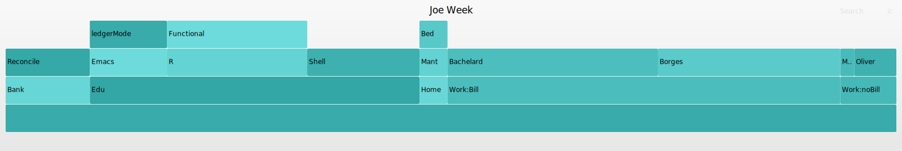

# Some scripts 

### tt 
script for timing task in bash with leadger 

[tt script](https://github.com/jero98772/scriptson0p/blob/main/bash/tt)

[docuemntation of tt](https://github.com/jero98772/scriptson0p/blob/main/bash/ttDocu.md)

### scriptBackup

Script for backup in multiple hard disks with rsync

[script backup](https://github.com/jero98772/scriptson0p/blob/main/bash/scriptBackup)

[documentation of ](https://github.com/jero98772/scriptson0p/blob/main/bash/scriptBackupDocu.md)

### Ledger to flamegraph

Sript to visualize timelogs from ledger in a flamegraph.pl  

[ledgerTimelogToFlamegraph](https://github.com/son0p/scriptson0p/blob/main/bash/ledgerTimelogToFlamegraph)

Demo: 
